#  SkiROS2: Skill-based robot control platform for ROS

## Overview

SkiROS2 is a platform to create complex robot behaviors by composing _skills_ - modular software blocks - into [behavior trees](https://en.wikipedia.org/wiki/Behavior_tree_(artificial_intelligence,_robotics_and_control)).

Robots coordinated with SkiROS can be used in partially structured environments, where the robot has a good initial understanding of the environment, but it is also expected to find discrepancies, fail using initial plans and react accordingly.

SkiROS offers the following features:

* A **framework** to organize the **robot behaviors** within **modular skill libraries**
* Scalable skill model with **pre-, hold- and post-conditions**
* A **reactive execution engine** based on **Behavior trees**
* A **world model** as a **semantic database** to manage environmental knowledge
* **Reasoning capabilities** and **automatic inference** of skill parameters
* An integration point for **PDDL task planning**
* **Automatic generation of planning domains** based on the skills and entities in the world model
* **ROS**, **RViz** and **tf integration**
* **Python APIs** for skill handling, the world model and task planning



## Getting Started

* **A full introduction and the tutorials are located in the [wiki](https://github.com/RVMI/skiros2/wiki)**
* Executable skill examples are in the [skiros2_examples repository](https://github.com/RVMI/skiros2_examples)
* The [SkiROS2 paper](https://arxiv.org/abs/2306.17030) provides an overview and background information
* The [skiros2_template_lib](https://github.com/RVMI/skiros2_template_lib) provides a skeleton for new skill  library
* Installation instructions are below

## Installation

### Compatibility

SkiROS is compatible with Ubuntu 18.04/ROS Melodic and Ubuntu 20.04/ROS Noetic, Python 2 and 3.

### Installation Instructions

To use SkiROS you must have [ROS](https://wiki.ros.org/ROS/Installation) installed on your machine.
You also need [pip](https://pip.pypa.io/en/stable/installing/) to install python dependencies.

Clone this repository into your catkin workspace src directory:
```shell
mkdir -p catkin_ws/src && cd catkin_ws/src
git clone https://github.com/RVMI/skiros2
# Clone the base skill set into the skiros2 directory in your catkin workspace.
git clone https://github.com/RVMI/skiros2_std_lib
# Optionally, you can clone the skiros2_examples repositories here as well:
git clone https://github.com/RVMI/skiros2_examples
```

Install dependencies defined in each `package.xml` using [rosdep](http://wiki.ros.org/rosdep) and the python dependencies:
```shell
rosdep install --from-paths . --ignore-src --rosdistro=$ROS_DISTRO -y
# Install Python dependencies
pip install -r requirements.txt --user
```
Build the workspace with catkin
```shell
cd ~/catkin_ws
catkin_make # or 'catkin build'
source ./devel/setup.bash
```
Launch SkiROS2
```shell
roslaunch skiros2 skiros.launch
# Or try one of the examples like
roslaunch skiros2_examples turtlesim_example.launch
```
### Task Planning
Optionally, if you want to use the task planning skill provided in the standard library, install the fast downward planner with the following script:

```shell
cd skiros2/scripts
./install_fd_task_planner.sh
```
When asked for the install folder, you can insert a location of your preference or just leave the default.

### Creating own skills
The [skiros2_template_lib](https://github.com/RVMI/skiros2_template_lib) provides the necessary structure to create a new library from scratch. It also has an example launch file to start the system.

## Build the Doxygen documentation

To generate the doxygen documentation, first install Doxygen and doxypypy for better compatibility with python doc-strings:

```shell
sudo apt-get install -y doxygen
pip install doxypypy --user
```

Then, in the top level directory, generate the documentation and view it with a browser, e.g. Firefox:
```shell
doxygen Doxyfile
firefox skiros2_doc/html/index.html
```

## Citation
A preprint of the SkiROS2 paper is [available here](https://arxiv.org/abs/2306.17030). If you are using it in your work, we would be please if you would cite it:
```bibtex
@misc{mayr2023skiros2,
      title={SkiROS2: A skill-based Robot Control Platform for ROS}, 
      author={Matthias Mayr and Francesco Rovida and Volker Krueger},
      year={2023},
      eprint={2306.17030},
      archivePrefix={arXiv},
      primaryClass={cs.RO}
}
```

## Acknowledgements

This platform has been developed at the [RVMI lab](http://www.rvmi.aau.dk/).

This project has received funding from the European Union’s Horizon 2020
research and innovation programme under grant agreement no. 723658, [Scalable4.0](https://www.scalable40.eu/).

This work was partially supported by the [Wallenberg AI, Autonomous Systems and Software Program (WASP)](https://wasp-sweden.org) funded by Knut and Alice Wallenberg Foundation